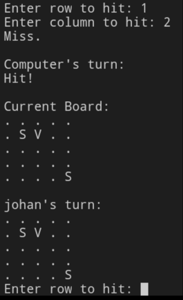

# Battleship Game

## Starting the Game

## Description
This Python project is a simple, text-based version of the classic game Battleship. The game is played against the computer in a 5x5 grid. Players take turns to guess the location of the enemy's ships and try to sink them all to win the game.

## Features
- Two boards: one for the player and one for the computer.
- Random placement of ships on the board.
- Turn-based gameplay allowing the player and the computer to guess ship locations.
- Real-time hit/miss feedback with each guess.
- Victory condition check after each turn.

## How to Play
1. Run the script in a Python environment.
2. Enter your name when prompted.

### During the Game

3. You will see your board with your ships (marked as 'S') and the hits or misses.
4. Enter the row and column numbers to hit a spot on the computer's board.
5. The game will indicate whether it was a hit or a miss.
6. The game ends when all ships on one board are sunk.

## Installation
No additional libraries are required to run this game. Just ensure you have Python installed on your system.

## Limitations
- The game currently does not have a graphical interface; it runs in the console.
- There is no difficulty level for the computer player; it makes random guesses.
- Board size and number of ships are fixed and cannot be changed in-game.

## Future Enhancements
- Adding a graphical user interface.
- Implementing adjustable difficulty levels.
- Allowing customizable board sizes and number of ships.

### Computer's Turn

### Game Over

